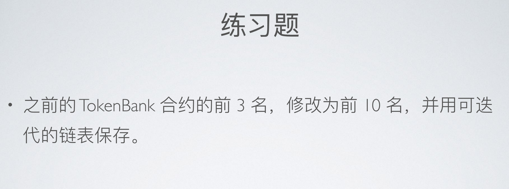

# 向 Bank 中加入存款排名



## A. 相关功能的代码解释

基于原 **`superbank`** 合约添加新功能（使用可迭代的链表保存 token 余额的排名信息），现已升级至 **`superbank_V2_4`** 合约。
以下仅针对新增功能及其辅助功能做解释：

### 1. 双向 mapping 变量的声明

```solidity
// 合约层级声明双向 mapping 状态变量
mapping(address tokenAddress => mapping(uint256 rankIndex => address userAddress)) internal tokenRankIndexToAddr;
mapping(address tokenAddress => mapping(address userAddress => uint256 rankIndex)) internal tokenRankAddrToIndex;
```

为了在用户存入 token 后可以快速定位到其排名的位置（如果可以跻身排名的话），我采用双向 mapping 变量实现新增功能，两变量分别为“自 index 至 address”的映射（[**tokenRankIndexToAddr**](./contracts/SuperBank_V2_4.sol#L25)）和“自 address 至 index”的映射（[**tokenRankAddrToIndex**](./contracts/SuperBank_V2_4.sol#L26)）。（两者互为逆向映射，且均为嵌套映射；外层的 key 为存入的 **ERC-20 token** 的合约地址，以方便接收多种 token。）

- `tokenRankIndexToAddr`：根据排名位置直接获得地址；
- `tokenRankAddrToIndex`：为地址“标记”其排名位置，当该地址对应的用户后续存款且影响了排名，则可以快速获知其排名变动的“出发点”，由此免去了每次存款都要自 mapping 变量的“起点”开始遍历。

以上两个 mapping 变量的组合模拟了“地址数组”的特性，但同时由于数据类型为 mapping，在占用的存储方面，比“地址数组”明显更好。

 注：**`superbank_V2_4`** 合约保留了这两种排名的实现方式：

- [**_executeRankMappingOfTokenBalance**](./contracts/SuperBank_V2_4.sol#L201-L256)方法
- [**_executeRankArrayOfTokenBalance**](./contracts/SuperBank_V2_4.sol#L270-L309)方法

---

### 2. 链表起点的初始化

```solidity
// 合约层级声明 origin 地址常量，作为起点地址
address constant origin = address(1);

function _executeRankMappingOfTokenBalance(address _tokenAddr, uint256 _amountInRank) internal {
// 初始化双向 mapping 变量的起点（地址为`origin`，`index`为 0 ）
	if (tokenRankIndexToAddr[_tokenAddr][0] == address(0)) {
   		tokenRankIndexToAddr[_tokenAddr][0] = origin;
   		tokenRankAddrToIndex[_tokenAddr][origin] = 0;
	}
	// 其他逻辑...
}
```

- [**tokenRankIndexToAddr**](./contracts/SuperBank_V2_4.sol#L25)“起点”位置的 `index` 为 0 ，地址为`origin`。
- [**tokenRankAddrToIndex**](./contracts/SuperBank_V2_4.sol#L26)“起点”位置的地址为`origin`， `index` 为 0 。

---

### 3. 判断存款用户的地址是否已经在排名之中

```solidity
function _executeRankMappingOfTokenBalance(address _tokenAddr, uint256 _amountInRank) internal {
	// 其他逻辑...
	bool isInRank = tokenRankAddrToIndex[_tokenAddr][msg.sender] != 0;
	
	// `maxIndexToStartLoop`，存款用户向前比较余额的用户的最大`index`，即从自身位置开始遍历与比较余额。
	uint256 maxIndexToStartLoop;
	
	// `indexToStartMoving`，当某用户存款且影响了排名，比该用户余额少但仍在排名之中的用户均向后挪动一个名次，此变量记录需要挪动的最大的index（自高位至低位逐一执行“向后挪动的操作”）。
	uint256 indexToStartMoving;
	// 其他逻辑...
	if (isInRank) {
     	// 场景 1 ：存款之前，用户已在排名之中
    	maxIndexToStartLoop = tokenRankAddrToIndex[_tokenAddr][msg.sender];
      indexToStartMoving = tokenRankAddrToIndex[_tokenAddr][msg.sender];
	} else {
	    // 场景 2 ：存款之前，用户不在排名之中
	    maxIndexToStartLoop = _amountInRank + 1;
	    indexToStartMoving = _amountInRank;
  }
}
```

用户是否在排名之中，影响着排名变动的算法（双向 mapping 变量所实现的排名算法为[**_executeRankMappingOfTokenBalance**](./contracts/SuperBank_V2_4.sol#L201-L256) 方法）。
当某个用户存款且影响了排名时，那些“比该用户余额少但仍在排名之中的用户”将分别向后挪动一个“名次”。这需要循环来实现这样的“挪位操作”，但是循环自身的起始索引的取值因“用户是否在存款前就已经在排名之中”而异（具体见下文关于“挪位操作”的循环的解释）。

---

### 4. For 循环：查找用户在存款后的排名位置

```solidity
function _executeRankMappingOfTokenBalance(address _tokenAddr, uint256 _amountInRank) internal {
    // 其他逻辑...
    for (uint256 i = maxIndexToStartLoop; i > 1; i--) {
        uint256 userBalance = tokenBalance[_tokenAddr][msg.sender];
        address previousUser = tokenRankIndexToAddr[_tokenAddr][i - 1];
        uint256 previousUserBalance = tokenBalance[_tokenAddr][previousUser];
        if (userBalance >= previousUserBalance) {
          // If the current address has won a new index which is in front of the current index of it,
          // record the new index by the variable `minIndexOccupied`.
          minIndexOccupied = i - 1;
          } else {
            break;
          }
    }
    // 其他逻辑...
}
```

当用户存款后，该用户排名位置（若存款前已在排名中）或从排名的末尾（若存款前未在排名中）向前（向低位）逐一进行余额的比较。每一次循环，若当前存款用户“超越”了“被比较的用户”，则使用`minIndexOccupied`记录“已赢取”的排名位置（即“赢取”了“被比较的用户”所在的排名位置）。

当某一次循环所比较的“被比较的用户”的余额比当前存款用户的余额高时，则中止并跳出循环。

---

### 5. 向后挪动“名次低于当前存款用户但位于排名之中的用户”的排名位置

```solidity
function _executeRankMappingOfTokenBalance(address _tokenAddr, uint256 _amountInRank) internal {
    // 其他逻辑...
    for (uint256 j = indexToStartMoving; j > minIndexOccupied; j--) {
        address previousUser = tokenRankIndexToAddr[_tokenAddr][j - 1];
        tokenRankIndexToAddr[_tokenAddr][j] = previousUser;
        tokenRankAddrToIndex[_tokenAddr][previousUser] = j;
    }
    // 其他逻辑...
}
```

将“名次低于当前存款用户但位于排名之中的用户”由高位向低位以此进行“向后挪动的操作”。

- 若存款用户在存款前已在排名中，则受到“向后挪动的操作”影响的排名用户为“自存款用户原排名位置之前的一名至存款用户新排名位置”（由高位向低位）的所有用户。
- 若存款用户在存款前未在排名中，则受到“向后挪动的操作”影响的排名用户为“排名末位至存款用户新排名位置”（由高位向低位）的所有用户，原末位的用户将被“挤出”排名。

---

### 6. 存款用户的新排名位置的链表处理

```solidity
function _executeRankMappingOfTokenBalance(address _tokenAddr, uint256 _amountInRank) internal {
    // 其他逻辑...
    if (minIndexOccupied != type(uint256).max - 1) {
        tokenRankAddrToIndex[_tokenAddr][msg.sender] = minIndexOccupied;
        tokenRankIndexToAddr[_tokenAddr][minIndexOccupied] = msg.sender;
    }
    // 其他逻辑...
}
```

- [**tokenRankAddrToIndex**](./contracts/SuperBank_V2_4.sol#L26) 将该存款用户地址的映射赋值为新排名位置。

- [**tokenRankIndexToAddr**](./contracts/SuperBank_V2_4.sol#L25) 将新排名位置的映射赋值该存款用户地址。

---

### 7. 用户存款触发排名算法

```solidity
// 直接存款（需提前 approve）：触发排名算法
function depositToken(address _tokenAddr, uint256 _tokenAmount) public {
    // 存款逻辑和其他逻辑...
    _handleRankOfTokenBalance(_tokenAddr);
}
    
// ERC2612离线签名 + 存款：触发排名算法
function depositTokenWithPermit(
    address _tokenAddr,
    uint256 _tokenAmount,
    uint256 _deadline,
    uint8 _v,
    bytes32 _r,
    bytes32 _s
) public {
    // 验签逻辑、存款逻辑和其他逻辑...
    _handleRankOfTokenBalance(_tokenAddr);
}

// 该方法包含了用映射实现 token 余额排名的方法
function _handleRankOfTokenBalance(address _tokenAddr) internal {
    // 其他逻辑...
    _executeRankMappingOfTokenBalance(_tokenAddr, limitAmountOfRank[_tokenAddr]);
    // 其他逻辑...
}
```

---

### 8. 查询当前的 token 余额排名

```solidity
function getTokenRankAccountsByMapping(address _tokenAddr, uint256 _amountInRank)
        public
        view
        returns (address[] memory)
	{
    if (limitAmountOfRank[_tokenAddr] == 0) {
   				revert noSuchTokenInBank(_tokenAddr);
    }
    if (_amountInRank > limitAmountOfRank[_tokenAddr]) {
        revert exceededRankLimit(_tokenAddr, _amountInRank, limitAmountOfRank[_tokenAddr]);
    }
    address[] memory rankList = new address[](_amountInRank);
    for (uint256 i = 0; i < _amountInRank; i++) {
        rankList[i] = tokenRankIndexToAddr[_tokenAddr][i + 1];
    }
    return rankList;
}
```

<br />


## B. SuperBank 合约功能解释与完整代码

```solidity
// SPDX-License-Identifier: MIT
pragma solidity ^0.8.0;

import "./Bank.sol";
import "@openzeppelin/contracts/token/ERC20/utils/SafeERC20.sol";
import "@openzeppelin/contracts/token/ERC20/extensions/ERC20Permit.sol";

/**
 * @title SuperBank can receive ETH and any ERC20 tokens tokens. And also, token balance rank is supported.
 *
 * @author Garen Woo
 */
contract SuperBank_V2_4 is Bank {
    mapping(address tokenAddress => mapping(address userAddress => uint256 balance)) internal tokenBalance;
    // Array realization: state variable `tokenBalanceRank` records the rank of the token balance.
    mapping(address tokenAddress => address[] rankList) internal tokenBalanceRank;
    // The state variable `limitAmountOfRank` only influence the Rank of token balance and its query.
    mapping(address tokenAddress => uint256 limit) internal limitAmountOfRank;
    /**
     * @dev Mapping realization: two mapping variables record the info related to the rank of the token balance.
     * First, state variable `tokenRankIndexToAddr` maps the index to address.
     * Second, state variable `tokenRankAddrToIndex` maps the address to index.
     */
    address constant origin = address(1);
    mapping(address tokenAddress => mapping(uint256 rankIndex => address userAddress)) internal tokenRankIndexToAddr;
    mapping(address tokenAddress => mapping(address userAddress => uint256 rankIndex)) internal tokenRankAddrToIndex;

    using SafeERC20 for IERC20;

    IERC20 internal iERC20Token;

    event tokenReceived(address sender, uint256 amount);
    event tokenWithdrawn(address tokenAddr, uint256 amount);

    error exceededRankLimit(address tokenAddr, uint256 inputAmount, uint256 limitAmount);
    error noSuchTokenInBank(address queriedToken);
    error zeroAmountOfWithdrawal();
    error insufficientTokenBalance(address tokenAddr, uint256 withdrawnAmount, uint256 balance);

    /**
     * @dev In the parent contract `Bank`, the constructor has already declared the owner of the contract.
     * Thus, here is no need to redeclared `owner`.
     */
    constructor() {}

    function depositToken(address _tokenAddr, uint256 _tokenAmount) public {
        iERC20Token = IERC20(_tokenAddr);
        /* 
        Considering the design of those functions with the prefix of "safe" in SafeERC20 library,
        if the token does not support safeTransferFrom, it will turn to call `transferFrom` instead.
        */
        iERC20Token.safeTransferFrom(msg.sender, address(this), _tokenAmount);
        tokenBalance[_tokenAddr][msg.sender] += _tokenAmount;
        _handleRankOfTokenBalance(_tokenAddr);
    }

    function depositTokenWithPermit(
        address _tokenAddr,
        uint256 _tokenAmount,
        uint256 _deadline,
        uint8 _v,
        bytes32 _r,
        bytes32 _s
    ) public {
        IERC20Permit(_tokenAddr).permit(msg.sender, address(this), _tokenAmount, _deadline, _v, _r, _s);
        iERC20Token = IERC20(_tokenAddr);
        /* 
        Considering the design of those functions with the prefix of "safe" in SafeERC20 library,
        if the token does not support safeTransferFrom, it will turn to call `transferFrom` instead.
        */
        iERC20Token.safeTransferFrom(msg.sender, address(this), _tokenAmount);
        tokenBalance[_tokenAddr][msg.sender] += _tokenAmount;
        _handleRankOfTokenBalance(_tokenAddr);
    }

    /**
     * @notice Any user can withdraw any amount of tokens which are already deposited by him(her).
     */
    function withdrawTokenByUser(address _tokenAddr, uint256 _amount) public {
        iERC20Token = IERC20(_tokenAddr);
        uint256 userTokenBalanceInBank = tokenBalance[_tokenAddr][msg.sender];
        if (_amount == 0) {
            revert zeroAmountOfWithdrawal();
        }
        if (_amount > userTokenBalanceInBank) {
            revert insufficientTokenBalance(_tokenAddr, _amount, userTokenBalanceInBank);
        }
        /* 
        Considering the design of those functions with the prefix of "safe" in SafeERC20 library,
        if the token does not support safeTransfer, it will turn to call `transfer` instead.
        */
        iERC20Token.safeTransfer(msg.sender, _amount);
        tokenBalance[_tokenAddr][msg.sender] -= _amount;
        emit tokenWithdrawn(_tokenAddr, _amount);
    }

    function tokensReceived(address _tokenAddr, address _from, uint256 _amount) external returns (bool) {
        tokenBalance[_tokenAddr][_from] += _amount;
        emit tokenReceived(_from, _amount);
        return true;
    }

    function setLimitAmountOfRank(address _tokenAddr, uint256 _newLimit) external onlyOwner {
        require(_newLimit >= 0, "invalid limit of Rank");
        uint256 previousLimit = limitAmountOfRank[_tokenAddr];
        limitAmountOfRank[_tokenAddr] = _newLimit;
        address[] memory rankArray = new address[](_newLimit);

        for (uint256 i = 0; i < previousLimit && i < _newLimit; i++) {
            rankArray[i] = tokenBalanceRank[_tokenAddr][i];
        }

        tokenBalanceRank[_tokenAddr] = rankArray;
    }

    function getLimitAmountOfRank(address _tokenAddr) public view returns (uint256) {
        if (limitAmountOfRank[_tokenAddr] == 0) {
            revert noSuchTokenInBank(_tokenAddr);
        }
        return limitAmountOfRank[_tokenAddr];
    }

    function getTokenBalance(address _tokenAddr, address _account) public view returns (uint256) {
        return tokenBalance[_tokenAddr][_account];
    }

    function getTokenRankAccountsByArray(address _tokenAddr, uint256 _amountInRank)
        public
        view
        returns (address[] memory)
    {
        if (limitAmountOfRank[_tokenAddr] == 0) {
            revert noSuchTokenInBank(_tokenAddr);
        }
        if (_amountInRank > limitAmountOfRank[_tokenAddr]) {
            revert exceededRankLimit(_tokenAddr, _amountInRank, limitAmountOfRank[_tokenAddr]);
        }
        address[] memory rankList = new address[](_amountInRank);

        for (uint256 i = 0; i < _amountInRank; i++) {
            rankList[i] = tokenBalanceRank[_tokenAddr][i];
        }
        return rankList;
    }

    function getTokenRankAccountsByMapping(address _tokenAddr, uint256 _amountInRank)
        public
        view
        returns (address[] memory)
    {
        if (limitAmountOfRank[_tokenAddr] == 0) {
            revert noSuchTokenInBank(_tokenAddr);
        }
        if (_amountInRank > limitAmountOfRank[_tokenAddr]) {
            revert exceededRankLimit(_tokenAddr, _amountInRank, limitAmountOfRank[_tokenAddr]);
        }
        address[] memory rankList = new address[](_amountInRank);

        for (uint256 i = 0; i < _amountInRank; i++) {
            rankList[i] = tokenRankIndexToAddr[_tokenAddr][i + 1];
        }
        return rankList;
    }

    /**
     * @dev This function is used for handle all the ranks supported in this contracts.
     *
     * @notice Currently, the top3-rank and top10-rank are supported.
     *
     * @param _tokenAddr the address of the ERC20 token contract which is related to this token balance rank.
     */
    function _handleRankOfTokenBalance(address _tokenAddr) internal {
        _checkAndInitialLengthOfRankArray(_tokenAddr);
        _executeRankMappingOfTokenBalance(_tokenAddr, limitAmountOfRank[_tokenAddr]);
        _executeRankArrayOfTokenBalance(_tokenAddr, limitAmountOfRank[_tokenAddr]);
    }

    function _checkAndInitialLengthOfRankArray(address _tokenAddr) internal {
        // If limitAmountOfRank[_tokenAddr] has not been initialized(When the deposit of this token occurs for the first time),
        // initialize it with the value of 10(This value can be modified by function `setLimitAmountOfRank` which can only be called by the owner of this contract).
        if (limitAmountOfRank[_tokenAddr] == 0) {
            limitAmountOfRank[_tokenAddr] = 10;
            uint256 limit = limitAmountOfRank[_tokenAddr];
            address[] memory rankArray = new address[](limit);
            tokenBalanceRank[_tokenAddr] = rankArray;
        }
    }

    /**
     * @dev This rank algorithm of listing the top several users with the highest token balances has been realized in the form of mapping in the following function.
     * The algorithm is created by Garen Woo. Withdrawal is not considered in this function.
     *
     * @param _tokenAddr the address of the ERC20 token contract which is related to this token balance rank.
     * @param _amountInRank the amount of addresses need to be involved in the rank list.
     *
     * @notice First, `minIndexOccupied` is a variable declared in the function body. It‘s the minimum index that the token balance of the current address has exceeded.
     * Second, `indexToStartMoving` is a variable declared in the function body. Its usage is as follows:
     * When the depositor is not involved in the rank list, `indexToStartMoving` will record the largest index of the rank list.
     * When the depositor has been in the rank list, `indexToStartMoving` will record the index which follows the updated index of the depositor after the deposit.
     */
    function _executeRankMappingOfTokenBalance(address _tokenAddr, uint256 _amountInRank) internal {
        // Check if the index 0 of `tokenRankIndexToAddr` in the contract of `_tokenAddr` maps to address(0).
        // If true, it means that the `tokenRankIndexToAddr` hasn't been ininitialized. Then, initialize it with `origin`'s address.
        // If false, it means that `tokenRankIndexToAddr` has already been initialized.
        if (tokenRankIndexToAddr[_tokenAddr][0] == address(0)) {
            tokenRankIndexToAddr[_tokenAddr][0] = origin;
            tokenRankAddrToIndex[_tokenAddr][origin] = 0;
        }
        // Except for the index of `origin` which is set to be 0, the index of any address else is defaulted to be 0 which means nonmembership of the rank.
        // However, any address except for `origin` cannot reach the index of 0 after being involved in this rank ever.
        bool isInRank = tokenRankAddrToIndex[_tokenAddr][msg.sender] != 0;
        uint256 minIndexOccupied = type(uint256).max - 1;
        uint256 maxIndexToStartLoop;
        uint256 indexToStartMoving;

        if (isInRank) {
            // Case 1: msg.sender is already inside the rank mapping
            // The maximum index of the for-loop is the one in front of the index of `msg.sender`.
            maxIndexToStartLoop = tokenRankAddrToIndex[_tokenAddr][msg.sender];
            indexToStartMoving = tokenRankAddrToIndex[_tokenAddr][msg.sender];
        } else {
            // Case 2: msg.sender is not in the rank mapping.
            // Since the depositor is not involved in the rank before the deposit, so this loop starts from `_amountInRank`(regard as a virtual index follows the tail-index of the rank) and ends at 2.
            maxIndexToStartLoop = _amountInRank + 1;
            indexToStartMoving = _amountInRank;
        }

        // For-loop: traverse elements from `maxIndexToStartLoop` to the start according to the index
        // Notice that index 0 is always mapping to origin. So, index 1 is the actual first-place of the rank.
        for (uint256 i = maxIndexToStartLoop; i > 1; i--) {
            uint256 userBalance = tokenBalance[_tokenAddr][msg.sender];
            address previousUser = tokenRankIndexToAddr[_tokenAddr][i - 1];
            uint256 previousUserBalance = tokenBalance[_tokenAddr][previousUser];

            if (userBalance >= previousUserBalance) {
                // If the current address has won a new index which is in front of the current index of it,
                // record the new index by the variable `minIndexOccupied`.
                minIndexOccupied = i - 1;
            } else {
                break;
            }
        }
        // All elements located after the current index(i.e. `minIndexOccupied`) are moved back by one index.
        // If minIndexOccupied is not given a value in the previous traversal, the following for-loop will be skipped.
        for (uint256 j = indexToStartMoving; j > minIndexOccupied; j--) {
            address previousUser = tokenRankIndexToAddr[_tokenAddr][j - 1];
            tokenRankIndexToAddr[_tokenAddr][j] = previousUser;
            tokenRankAddrToIndex[_tokenAddr][previousUser] = j;
        }

        // Set the two mapping variables according to `minIndexOccupied` after the completion of both the loop and the moving back of those "rear elements".
        if (minIndexOccupied != type(uint256).max - 1) {
            tokenRankAddrToIndex[_tokenAddr][msg.sender] = minIndexOccupied;
            tokenRankIndexToAddr[_tokenAddr][minIndexOccupied] = msg.sender;
        }
    }

    /**
     * @dev This rank algorithm of listing the top several users with the highest token balances has been realized in the form of array in the following function.
     * The algorithm is created by Garen Woo. Withdrawal is not considered in this function.
     *
     * @param _tokenAddr the address of the ERC20 token contract which is related to this token balance rank.
     * @param _amountInRank the amount of addresses need to be involved in the rank list.
     *
     * @notice First, `minIndexOccupied` is a variable declared in the function body. It‘s the minimum index that the token balance of the current address has exceeded.
     * Second, `indexToStartMoving` is a variable declared in the function body. Its usage is as follows:
     * When the depositor is not involved in the rank list, `indexToStartMoving` will record the largest index of the rank list.
     * When the depositor has been in the rank list, `indexToStartMoving` will record the index which follows the updated index of the depositor after the deposit.
     */
    function _executeRankArrayOfTokenBalance(address _tokenAddr, uint256 _amountInRank) internal {
        uint256 membershipIndex = _checkTokenRankMembership(_tokenAddr, _amountInRank);
        uint256 minIndexOccupied = type(uint256).max - 1;
        uint256 maxIndexToStartLoop;
        uint256 indexToStartMoving;

        if (membershipIndex != type(uint256).max - 2) {
            // Case 1: msg.sender is already inside the rank array
            // The maximum index of the for-loop is the one in front of the index of `msg.sender`.
            maxIndexToStartLoop = membershipIndex;
            indexToStartMoving = membershipIndex;
        } else {
            // Case 2: msg.sender is not in the rank array
            // Since the depositor is not involved in the rank before the deposit, so this loop starts from `_amountInRank`(regard as a virtual index follows the tail-index of the rank) and ends at 1.
            maxIndexToStartLoop = _amountInRank;
            indexToStartMoving = _amountInRank - 1;
        }
        // Boundary case: membershipIndex == 0, is not suitable for this traversal. It means that the token balance of the current account have already at the index 0.
        // Thus, this traversal ends at 1.
        for (uint256 i = maxIndexToStartLoop; i > 0; i--) {
            // i - 1, is the index whose token balance is compared with in the current loop.
            address previousUser = tokenBalanceRank[_tokenAddr][i - 1];
            if (tokenBalance[_tokenAddr][msg.sender] >= tokenBalance[_tokenAddr][previousUser]) {
                // If the current address has won a new index which is in front of the current index of it,
                // record the new index by the variable `minIndexOccupied`.
                minIndexOccupied = i - 1;
            } else {
                break;
            }
        }
        // All elements located after the current index(i.e. `minIndexOccupied`) are moved back by one index.
        for (uint256 j = indexToStartMoving; j > minIndexOccupied; j--) {
            tokenBalanceRank[_tokenAddr][j] = tokenBalanceRank[_tokenAddr][j - 1];
        }

        // Set the value of `tokenBalanceRank[_tokenAddr][minIndexOccupied]` according to `minIndexOccupied` after the completion of both the loop and the moving back of those "rear elements".
        if (minIndexOccupied != type(uint256).max - 1) {
            tokenBalanceRank[_tokenAddr][minIndexOccupied] = msg.sender;
        }
    }

    /**
     * @dev Check if the depositor is already in the rank list.
     *
     * @param _amountInRank the amount of addresses need to be involved in the rank list
     */
    function _checkTokenRankMembership(address _tokenAddr, uint256 _amountInRank) internal view returns (uint256) {
        uint256 index = type(uint256).max - 2;
        for (uint256 i = 0; i < _amountInRank; i++) {
            if (tokenBalanceRank[_tokenAddr][i] == msg.sender) {
                index = i;
                break;
            }
        }
        return index;
    }
}
```

### 附：bank 合约（父合约）代码

```solidity
// SPDX-License-Identifier: MIT
pragma solidity ^0.8.0;

contract Bank {
    // To protect personal privacy, some of the variables are set internal.
    // To get those values of variables, set getter-functions to get users' values by their own instead of being queried by anyone.
    mapping(address => uint) internal ETHBalance;
    address[3] internal rank;
    address public owner;
    error NotOwner(address caller, address owner);

    constructor() {
        owner = msg.sender;
    }

    modifier onlyOwner() {
        if (msg.sender != owner) {
            revert NotOwner(msg.sender, owner);
        }
        _;
    }

    function depositETH() public payable {
        ETHBalance[msg.sender] += msg.value;
        _handleRankWhenDepositETH();
    }

    receive() external payable virtual {
        depositETH();
    }

    function withdrawETH() public onlyOwner {
        payable(owner).transfer(address(this).balance);
    }

    function getETHBalance(
        address _account
    ) public view virtual returns (uint) {
        return ETHBalance[_account];
    }

    function getETHTopThreeAccount()
        public
        view
        returns (address, address, address)
    {
        return (rank[0], rank[1], rank[2]);
    }

    function _handleRankWhenDepositETH() internal {
        uint membershipIndex = _checkETHRankMembership();
        uint convertedIndex;
        uint indexRecord = 777;
        if (membershipIndex != 999) {
            // Case 1: msg.sender is already inside the top3 rank.
            convertedIndex = membershipIndex + 4;
            for (uint i = convertedIndex - 3; i > 1; i--) {
                if (membershipIndex != 0) {
                    if (ETHBalance[msg.sender] >= ETHBalance[rank[i - 2]]) {
                        indexRecord = i - 2;
                        for (uint j = 2; j > i - 2; j--) {
                            rank[j] = rank[j - 1];
                        }
                        // Boundry condition
                        if (indexRecord == 0) {
                            rank[indexRecord] = msg.sender;
                        }
                    } else {
                        if (indexRecord != 777) {
                            rank[indexRecord] = msg.sender;
                        }
                    }
                }
            }
        } else {
            // Case 2: msg.sender is not inside the top3 rank.
            for (uint i = 3; i > 0; i--) {
                if (ETHBalance[msg.sender] >= ETHBalance[rank[i - 1]]) {
                    indexRecord = i - 1;
                    // move backward the element(s) which is(/are) right at the index and also behind the index
                    for (uint j = 2; j > i - 1; j--) {
                        rank[j] = rank[j - 1];
                    }
                    // Boundry condition
                    if (indexRecord == 0) {
                        rank[indexRecord] = msg.sender;
                    }
                } else {
                    if (indexRecord != 777) {
                        rank[indexRecord] = msg.sender;
                    }
                }
            }
        }
    }

    function _checkETHRankMembership() internal view returns (uint) {
        uint index = 999;
        for (uint i = 0; i < 3; i++) {
            if (rank[i] == msg.sender) {
                index = i;
                break;
            }
        }
        return index;
    }
}
```

------------------------------------------------------ **END** ------------------------------------------------------
