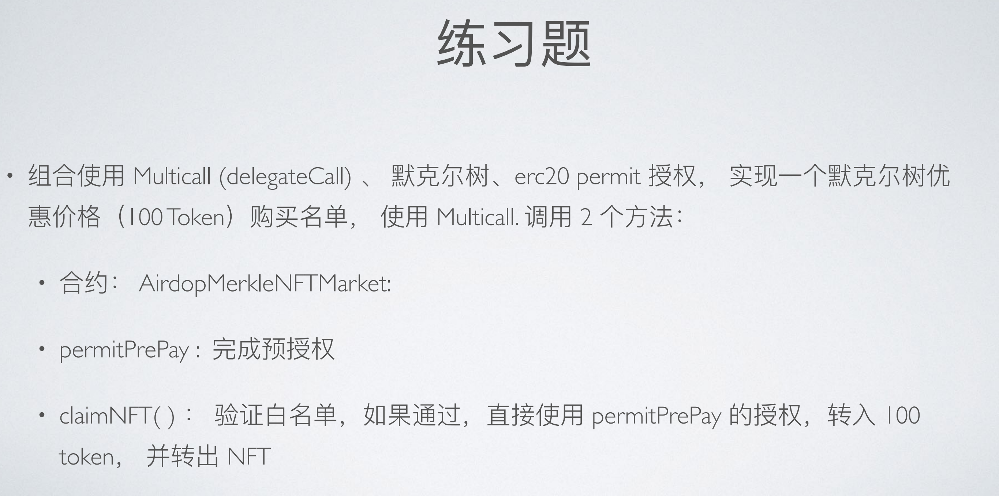
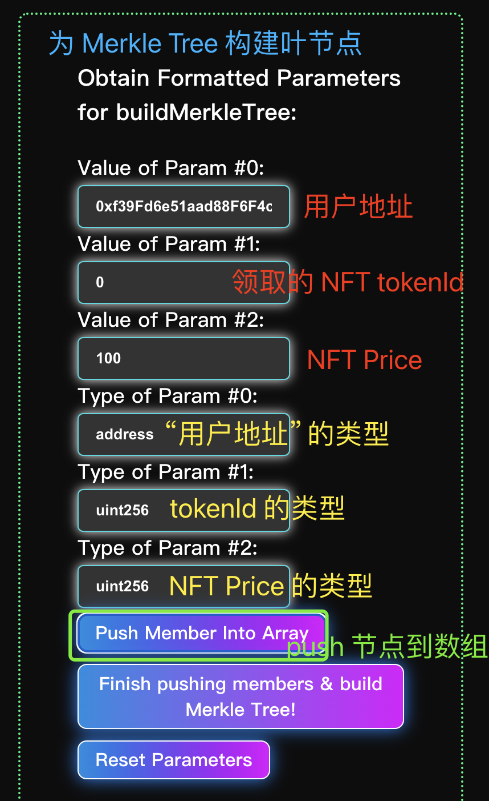
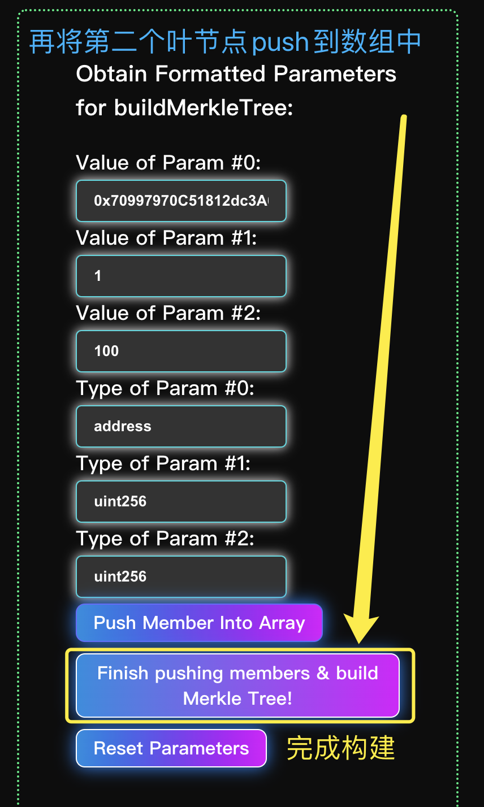
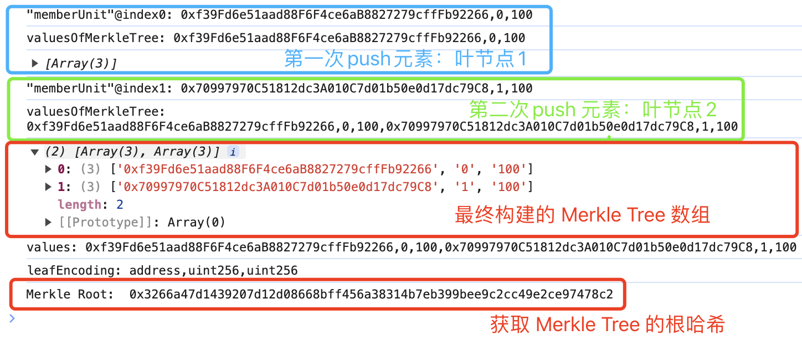
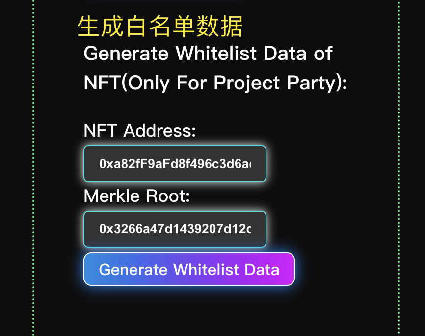
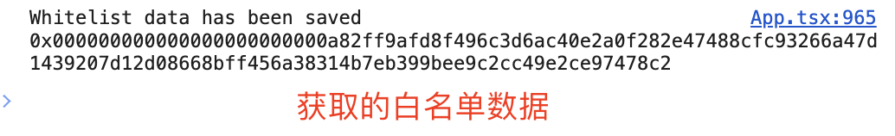
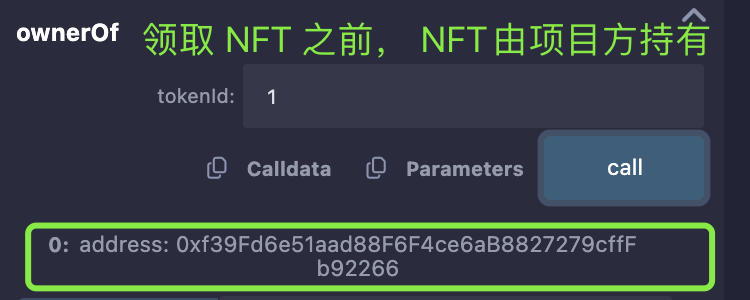
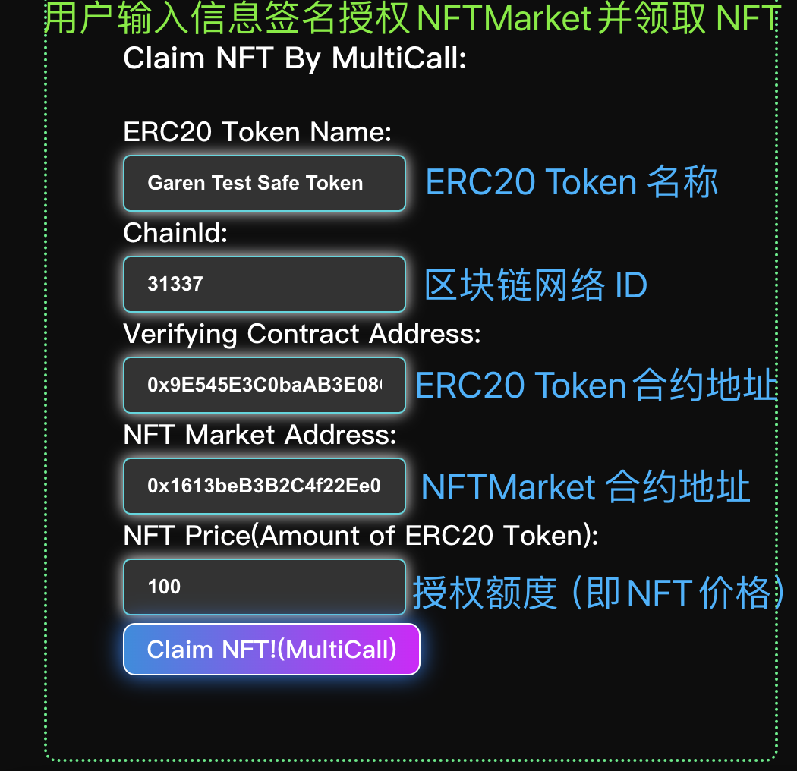
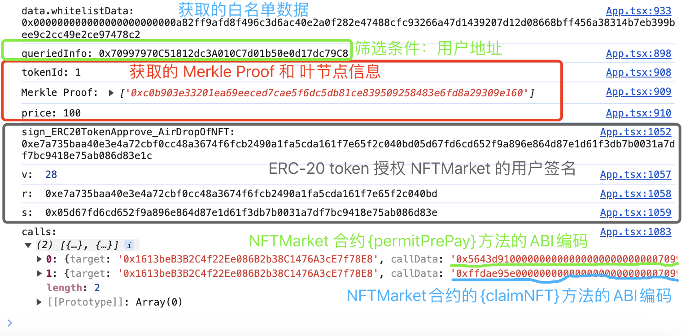
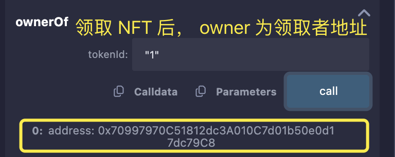

# 练习题（01.31）：练习题 2



### 目录

1. [演示功能](#1. 演示功能)

   1-1. [NFT 项目方构建白名单（Merkle Tree）](#1-1. NFT 项目方构建白名单（Merkle Tree）)

   1-2. [NFT 项目方生成白名单数据](#1-2. NFT 项目方生成白名单数据)

   1-3. [用户领取 NFT](#1-3. 用户领取 NFT)

2. [构建白名单与生成相关数据](#2. 构建白名单与生成相关数据)

   2-1. [NFT 项目方使用 Merkle Tree 构建用户白名单](#2-1. NFT 项目方使用 Merkle Tree 构建用户白名单)

   2-2. [获取 Merkle Proof 和相关叶节点数据](#2-2. 获取 Merkle Proof 和相关叶节点数据)

   2-3. [NFT 项目方生成白名单数据](#2-3. NFT 项目方生成白名单数据)

   2-4. [获取白名单数据](#2-4. 获取白名单数据)

3. [合约方法](#3. 合约方法)

   3-1. [ {permitPrePay}：完成 ERC-20 token 预授权](#3-1. {permitPrePay}：完成 ERC-20 token 预授权)

   3-2. [ {claimNFT}：验证用户是否位于白名单内，验证通过发放 NFT](#3-2. {claimNFT}：验证用户是否位于白名单内，验证通过发放 NFT)

   3-3. [ {aggregate}：调用多个方法（multicall）](#3-3. {aggregate}：调用多个方法（multicall）)


## 1. 演示功能

示例：用户 0x70997970C51812dc3A010C7d01b50e0d17dc79C8 为 NFT 合约 0xa82fF9aFd8f496c3d6ac40E2a0F282E47488CFc9 的白名单用户，可领取`tokenId`为 1 的 NFT，价格为 100 个 ERC-20 token 。

### 1-1. NFT 项目方构建白名单（Merkle Tree）

构建一个白名单，每个叶节点包含用户地址、领取 NFT 的`tokenId`、NFT Price（以 ERC-20 token 计量）

例如构建一个简单的 Merkle Tree：

- 叶节点 1: 
  - 用户地址：0xf39Fd6e51aad88F6F4ce6aB8827279cffFb92266
  - NFT `tokenId`：0
  - NFT Price: 100
- 叶节点 2：
  - 用户地址：0x70997970C51812dc3A010C7d01b50e0d17dc79C8
  - NFT `tokenId`：1
  - NFT Price: 100







因此，构建的 Merkle Tree 应为：[["0xf39Fd6e51aad88F6F4ce6aB8827279cffFb92266", "0", "200"],["0x70997970C51812dc3A010C7d01b50e0d17dc79C8", "1", "300"]]


### 1-2. NFT 项目方生成白名单数据





因此，白名单数据：0x000000000000000000000000a82ff9afd8f496c3d6ac40e2a0f282e47488cfc93266a47d1439207d12d08668bff456a38314b7eb399bee9c2cc49e2ce97478c2


### 1-3. 用户领取 NFT

在领取之前，`tokenId`为 1 的 NFT 持有者为 0xf39Fd6e51aad88F6F4ce6aB8827279cffFb92266 （NFT 项目方地址）且已授权给 NFTMarket（`AirDropMerkleNFTMarket`合约：0x1613beB3B2C4f22Ee086B2b38C1476A3cE7f78E8）。



用户输入信息对 NFTMarket（`AirDropMerkleNFTMarket`合约：0x1613beB3B2C4f22Ee086B2b38C1476A3cE7f78E8）授权与 NFT Price 等数额的 ERC-20 Token，并领取 NFT（同时为 NFT 项目方地址转入 ERC-20 Token）

在合约层面，该功能用 multicall 的方式在一笔交易内依次调用 NFTMarket（`AirDropMerkleNFTMarket`合约）的 {permitPrePay} 方法和 {claimNFT} 方法。



执行 multicall 时的相关数据



领取后，该 NFT 的持有者为领取者地址：




## 2. 构建白名单与生成相关数据

### 2-1. NFT 项目方使用 Merkle Tree 构建用户白名单

```javascript
	// 前端代码：

	/** 
 	* @dev 为 Merkle Tree 新增叶节点（一个数组，包含了 3 个元素：用户地址、NFT 的`tokenId`和 NFT 的价格）
 	* `valuesOfMerkleTree`为一个全局变量，是 Merkle Tree 的包含了所有叶节点的一个数组，其中的每个元素是一个叶节点
 	*/
	const pushMemberForParamOfMerkleTree = () => {
    const valueOfParam0 = valueOfParam0_MerkleTree.current?.value;
    const valueOfParam1 = valueOfParam1_MerkleTree.current?.value;
    const valueOfParam2 = valueOfParam2_MerkleTree.current?.value;
    if (valueOfParam0 && valueOfParam1 && valueOfParam2) {
      const memberUnit = [valueOfParam0, valueOfParam1, valueOfParam2];
      valuesOfMerkleTree.push(memberUnit);
      console.log(`"memberUnit"@index${inputCounter}: ${memberUnit}`);
      console.log(`valuesOfMerkleTree: ${valuesOfMerkleTree}`);
      console.log(valuesOfMerkleTree);
      inputCounter++;
    }
	};

	/** 
 	* @dev 构建 Merkle Tree 新增叶节点（每个叶节点是一个数组，包含了 3 个元素：用户地址、NFT 的`tokenId`和 NFT 的价格）
 	* 全局变量`valuesOfMerkleTree`为含有全部叶节点的数组
 	* 局部变量`leafEncoding`为单个叶节点中各索引的数据类型作为元素而组成的数组
 	* 此函数将`valuesOfMerkleTree`与`leafEncoding`发送给后端服务器构建 Merkle Tree
 	*/
	const buildMerkleTree = async () => {
    const typeOfAccount: any = typeOfParam0_MerkleTree.current?.value;
    const typeOfTokenId: any = typeOfParam1_MerkleTree.current?.value;
    const typeOfPrice: any = typeOfParam2_MerkleTree.current?.value;
    const values = valuesOfMerkleTree;
    const leafEncoding = [typeOfAccount, typeOfTokenId, typeOfPrice];
    console.log(`values: ${values}`);
    console.log(`leafEncoding: ${leafEncoding}`);
    try {
      const response = await fetch("http://localhost:3001/save-merkle-tree", {
        method: "POST",
        headers: {
          "Content-Type": "application/json",
        },
        body: JSON.stringify({ values, leafEncoding }),
      });
      const responseData = await response.json();
      console.log("Merkle Root: ", responseData.MerkleRoot);
    } catch (error) {
      console.error("Failed to save Merkle tree data:", error);
    }
	};

	/** 
   * @dev 重置 Merkle Tree 的方法，以方便前端重新构建 Merkle Tree
	 */
	const resetParametersOfMerkleTree = () => {
    if (valueOfParam0_MerkleTree.current)
      valueOfParam0_MerkleTree.current.value = "";
    if (valueOfParam1_MerkleTree.current)
      valueOfParam1_MerkleTree.current.value = "";
    if (valueOfParam2_MerkleTree.current)
      valueOfParam2_MerkleTree.current.value = "";
    if (typeOfParam0_MerkleTree.current)
      typeOfParam0_MerkleTree.current.value = "";
    if (typeOfParam1_MerkleTree.current)
      typeOfParam1_MerkleTree.current.value = "";
    if (typeOfParam2_MerkleTree.current)
      typeOfParam2_MerkleTree.current.value = "";
    valuesOfMerkleTree = [];
    inputCounter = 0;
    console.log(`All the parameters for building Merkle tree have been reset.`);
  };
```

```javascript
	// 后端代码：

	/** 
 	* @dev 接收前端传来的`valuesOfMerkleTree`与`leafEncoding`，构建和保存 Merkle Tree
 	* 返回给前端的 MerkleRoot 为 Merkle Tree 的根节点哈希
 	*/
	app.post('/save-merkle-tree', (req, res) => {
    const { values, leafEncoding } = req.body;
    console.log(`values: ${values}`);
    console.log(`leafEncoding: ${leafEncoding}`);
    const tree = StandardMerkleTree.of(values, leafEncoding);
    console.log(`Merkle Root: ${tree.root}`)
    const dirPath = path.join(__dirname, 'NFTProjectFiles');
    const filePath = path.join(dirPath, 'tree.json');

    if (!fs.existsSync(dirPath)) {
        fs.mkdirSync(dirPath, { recursive: true });
    }
    fs.writeFileSync(filePath, JSON.stringify(tree.dump()));
    res.send({ MerkleRoot: tree.root });
	});

```


### 2-2. 获取 Merkle Proof 和相关叶节点数据

```javascript
	// 前端代码：

	/**
   * @dev 依据筛选条件（用户地址）`_queriedInfo` 获取该地址所在叶节点的数据（NFT 的`tokenId`和 NFT 的价格）以及该叶节点的 Merkle Proof
   */
  const getMerkleProofAndInfo = async () => {
    let counter = 0;
    const provider = new ethers.BrowserProvider(window.ethereum);
    const signer = await provider.getSigner();
    const queriedInfo = await signer.getAddress();
    console.log(`queriedInfo: ${queriedInfo}`);
    while (counter < 20 && queriedInfo) {
      try {
        const url = new URL("http://localhost:3001/merkle-proof");
        url.search = new URLSearchParams({ queriedInfo }).toString();
        const response = await fetch(url);
        if (!response.ok) {
          throw new Error("Network response was not ok");
        }
        const data = await response.json();
        console.log("tokenId:", data.tokenId);
        console.log("Merkle Proof:", data.MerkleProof);
        console.log("price:", data.price);
        return { MerkleProof: data.MerkleProof, tokenId: data.tokenId, price: data.price }
      } catch (error) {
        counter++;
        console.error("Failed to fetch Merkle proof:", error);
      }
    }
    if (counter >= 20) {
      console.log("Failed to fetch data after several attempts");
    }
    return { MerkleProof: undefined, tokenId: undefined }
  };
```

```javascript
	// 后端代码：

	/** 
	 * @dev 接收前端传来的`queriedInfo`作为筛选条件，筛出 Merkle Tree 中该地址对应的叶节点（如果有的话）
	 * 向前端返回 Merkle Proof 和该叶节点的叶节点的数据（NFT 的`tokenId`和 NFT 的价格）
	 */
	app.get('/merkle-proof', (req, res) => {
    const queriedInfo = req.query.queriedInfo;
    const dirPath = path.join(__dirname, 'NFTProjectFiles');
    const filePath = path.join(dirPath, 'tree.json');
    const treeData = JSON.parse(fs.readFileSync(filePath, "utf8"));
    const tree = StandardMerkleTree.load(treeData);

    for (const [i, v] of tree.entries()) {
        if (v[0] === queriedInfo) {
            const proof = tree.getProof(i);
            return res.json({
                value: v,
                MerkleProof: proof,
                tokenId: v[1],
                price: v[2]
            });
        }
    }

    res.status(404).send('Queried infomation is not found in the Merkle Tree');
	});
```


### 2-3. NFT 项目方生成白名单数据

**白名单数据**包含 <u>NFT 合约地址</u>与<u>白名单的 Merkle Root</u>，这个数据数据对应唯一的NFT合约与“优惠活动”，由项目方发送给白名单用户，或者直接公开。

```javascript
	// 前端代码：

	/**
	 * @dev NFT 项目方通过前端输入 NFT合约地址、Merkle Root，传递给后端服务器进行数据处理
	 */
	const generateWhitelistData = async () => {
    const NFTAddr = NFTAddr_WhitelistData.current?.value;
    const MerkleRoot = MerkleRoot_WhitelistData.current?.value;
    const NFTAbi = [
      "function launchSpecialOfferWithUniformPrice(bytes32) external view returns (bytes memory)",
    ];

    try {
      const response = await fetch(
        "http://localhost:3001/generate-whitelist-data",
        {
          method: "POST",
          headers: {
            "Content-Type": "application/json",
          },
          body: JSON.stringify({ NFTAddr, MerkleRoot, NFTAbi, network_RPC_URL }),
        }
      );
      const responseData = await response.json();
      console.log(responseData.message, responseData.whitelistData);
    } catch (error) {
      console.error(
        "Failed to send parameters to generate whitelist data:",
        error
      );
    }
	};
```

```javascript
	// 后端代码：

	/** 
 	* @dev 接收前端传来的 NFT 合约地址`NFTAddr`、Merkle Root、NFT 合约的 ABI（仅包含处理白名单数据方法的二进制接口）以及 对应区块链网络的 RPC URL
 	* 实例化 NFT 合约并调用其中的{}方法对数据进行处理并返回白名单数据
 	*/
	app.post('/generate-whitelist-data', async (req, res) => {
    const { NFTAddr, MerkleRoot, NFTAbi, network_RPC_URL } = req.body;
    console.log(`NFTAddr: ${NFTAddr}`);
    console.log(`MerkleRoot: ${MerkleRoot}`);
    console.log(`NFTAbi: ${NFTAbi}`);
    console.log(`network_RPC_URL: ${network_RPC_URL}`);
    const provider = new ethers.getDefaultProvider(network_RPC_URL);
    const NFTContract = new ethers.Contract(NFTAddr, NFTAbi, provider);
    let whitelistData;
    try {
        whitelistData = await NFTContract.launchSpecialOfferWithUniformPrice(MerkleRoot);
    } catch (error) {
        console.error(error);
        res.status(500).send('Error calling contract function');
    }
    console.log(`whitelistData: ${whitelistData}`);
    const dirPath = path.join(__dirname, 'NFTProjectFiles');
    const filePath = path.join(dirPath, 'whitelistData.json');

    if (!fs.existsSync(dirPath)) {
        fs.mkdirSync(dirPath, { recursive: true });
    }
    fs.writeFileSync(filePath, JSON.stringify(whitelistData));
    res.send({ message: "Whitelist data has been saved", whitelistData: whitelistData });
	});
```

```solidity
	// ERC721TokenWithPermit_V2_1 合约（即 NFT 合约）：

	// 将当前合约（NFT 合约）地址与 Merkle Root 编码 ，作为白名单数据返回：
	function launchSpecialOfferWithUniformPrice(bytes32 _MerkleRoot) public view onlyOwner returns (bytes memory) {
			bytes memory whitelistData = abi.encode(address(this), _MerkleRoot);
			return whitelistData;
	}
```


### 2-4. 获取白名单数据

```javascript
	// 前端代码：

	/** 
	 * @dev NFT 项目方读取已生成的白名单数据并返回，以供白名单数据展示
	 */
	const getWhitelistData = async () => {
    let counter = 0;
    while (counter < 20) {
      try {
        const url = new URL("http://localhost:3001/whitelist-data");
        const response = await fetch(url);
        if (!response.ok) {
          throw new Error("Network response was not ok");
        }
        const data = await response.json();
        console.log(`data.whitelistData: ${data.whitelistData}`);
        return data.whitelistData;
      } catch (error) {
        counter++;
        console.error("Failed to fetch whitelist data:", error);
      }
    }
    if (counter >= 20) {
      console.log("Failed to fetch data after several attempts");
    }
  };
```

```javascript
	// 后端代码：
	
	/** 
	 * @dev 读取服务器内存储的白名单数据并返回给前端
	 */
	app.get('/whitelist-data', (req, res) => {
    const dirPath = path.join(__dirname, 'NFTProjectFiles');
    const filePath = path.join(dirPath, 'whitelistData.json');
    const whitelistData = JSON.parse(fs.readFileSync(filePath, "utf8"));
    console.log(`whitelistData@BackEnd: ${whitelistData}`);
    return res.json({
        whitelistData,
    });
	});
```


## 3. 合约方法

### 3-1. {permitPrePay}：完成 ERC-20 token 预授权

```solidity
	// AirDropMerkleNFTMarket 合约：
	
	/**
	 * @dev 通过 ERC20-permit 验证用户签名，若通过则授权{AirDropMerkleNFTMarket}合约使用该用户的 token，用于领取 NFT
	 * 
	 * @param _tokenOwner ERC-20 token 的持有者地址
	 * @param _tokenAmount 授权的额度（与白名单该用户所领取的 NFT 的价格相等）
	 */
	function permitPrePay(address _tokenOwner, uint256 _tokenAmount, uint256 _deadline, uint8 _v, bytes32 _r, bytes32 _s) public returns (bool) {
        IERC20Permit(tokenAddr).permit(_tokenOwner, address(this), _tokenAmount, _deadline, _v, _r, _s);
        emit prepay(_tokenOwner, _tokenAmount);
        return true;
    }
```


### 3-2. {claimNFT}：验证用户是否位于白名单内，验证通过发放 NFT

```solidity
		// AirDropMerkleNFTMarket 合约：
		
		/**
	 	* @dev 验证用户是否位于白名单内，验证通过发放 NFT
	 	*
	 	* @param _recipient 领取 NFT 的地址
	 	* @param _promisedTokenId 白名单内该用户可领取的 NFT 所对应的`tokenId`（待被验证数据之一）
	 	* @param _merkleProof 根据领取者地址返回的 Merkle Proof ，由项目方提供（用于验证用户是否位于白名单内部）
	 	* @param _promisedPrice 白名单内该用户可领取的 NFT 所对应的价格（用 ERC-20 token 计量，待被验证数据之一）
	 	* @param _NFTWhitelistData 白名单数据，由商家公布（获取到 NFT 合约地址和 Merkle Root）
	 	*/
		function claimNFT(address _recipient, uint256 _promisedTokenId, bytes32[] memory _merkleProof, uint256 _promisedPrice, bytes memory _NFTWhitelistData)
        public
    {
        (address whitelistNFTAddr, bytes32 MerkleRoot) = abi.decode(_NFTWhitelistData, (address, bytes32));
        // Verify the membership of whitelist using Merkle tree.
        bytes32 leaf = keccak256(bytes.concat(keccak256(abi.encode(_recipient, _promisedTokenId, _promisedPrice))));
        _verifyMerkleProof(_merkleProof, MerkleRoot, leaf);
        // Considering the design of those functions with the prefix of "safe" in SafeERC20 library,
        // if the token does not support `safeTransferFrom`, it will turn to call `transferFrom` instead.
        IERC20(tokenAddr).safeTransferFrom(_recipient, address(this), _promisedPrice);
        address NFTOwner = IERC721(whitelistNFTAddr).ownerOf(_promisedTokenId);
        IERC721(whitelistNFTAddr).transferFrom(NFTOwner, _recipient, _promisedTokenId);
        userProfit[NFTOwner] += _promisedPrice;
        emit NFTClaimed(whitelistNFTAddr, _promisedTokenId, _recipient);
    }
```


### 3-3. {aggregate}：调用多个方法（multicall）

```solidity
		// AirDropMerkleNFTMarket 合约：
		
	 /** 
	 	* @dev 一笔交易内，多个方法的调用
	 	*
	 	* @param _calls 结构体数组，每个元素是一次函数调用，内含字段 target 和 callData 分别为合约地址和方法的 ABI 编码
	 	*
	 	* @return returnData 所调用的函数的返回值组成的数组
	 	*/
		function aggregate(Call[] memory _calls) public returns(bytes[] memory returnData) {
        returnData = new bytes[](_calls.length);
        for (uint256 i = 0; i < _calls.length; i++) {
            (bool success, bytes memory returnBytes) = (_calls[i].target).call(_calls[i].callData);
            if (!success) {
                revert multiCallFail(i, _calls[i].callData);
            }
            returnData[i] = returnBytes;
        }
    }
```

